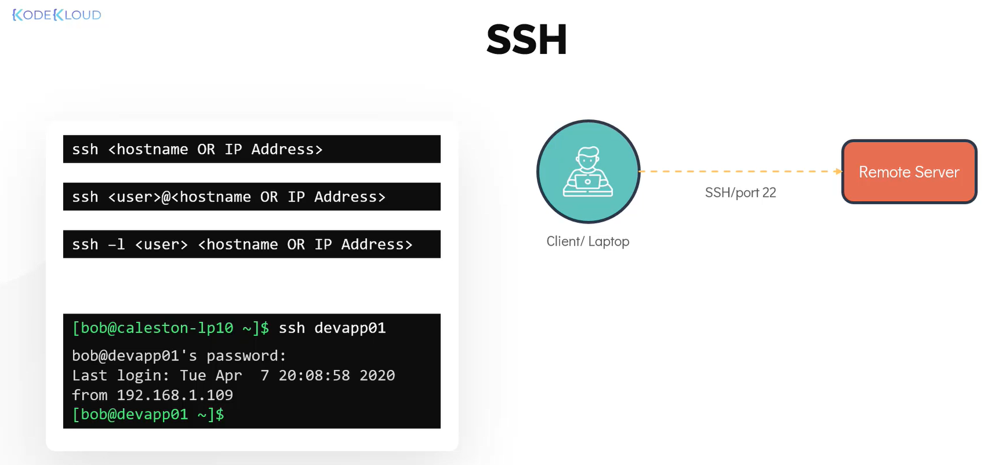
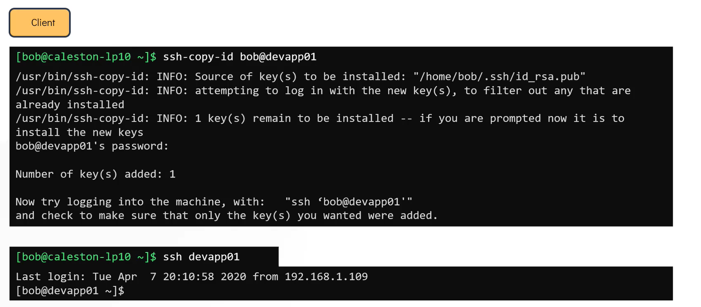

# Security and File Permissions

## Linux Accounts

> ### Linux Security:
Security in linux is a very vast topic and involvs many topics.  
</br>
- **Access Control Methods**: Uses user and password based authentication, to decide who can access the system.
- **PAM**: **Pluggable Authentication Model** another way to mange authentication. Normally used to authenticate user for programs and services in linux.
- **Network Security**: To restrict or allow access to services listening on the server. Normally we rely on external firewalls. It can also be setup in system using tools like IPTables and Firewalld.
- **SSH Hardneing**: **Secure Shell** used for remote access. SSH Hardening makes sure only authorized user have access to system.
- **SELinux**: Uses security policies for isolating applications running on the same system from each other. 
---
> ### User Accounts:
Every user in linux associates with an account. User account maintains <username, passwordm, UID> to login into the system.  
UID - UserID which is unique to each user.  
User account information stored in **`/etc/passwd`** file  
</br>
---
> ### Groups:
Group is a collection of user. Used to organize users based on common attributes such as role or a function.  
Group information stored in **`/etc/group`** file.  
Each group has unique identifier which is GID (Group ID)  
Suppose we have two developers bob and michael, who has similar role, we can group them in a "Developer" gorup. So we can provide similar access for them to files and folders in the system.  
</br>
---
> ### User Account Details:
Every user account contains details like
- **Username**
- **UID (UserID)**, uniquer to each user
- **ID (GroupID)**, group they are part of. User can be part of multiple groups. If no group is specified while creating user, it assign a group with same ID and name as of userID. That wil be primary GID of user.
- **Home Directory**. Ex: `/home/<user_name>`
- **Default shell**. With which user can log in and use. Ex: `/bin/sh`.
 
We can get these details by below command
- Shows the UID (user ID), GID (group ID), and group memberships for Bob. It confirms he's a user account and his group info.
  ```
  id <username>
  ```
  
- To retrieves the full entry from the system's user database, showing details like username, UID, GID, home directory, and default shell.
  ```
  getent passwd <user_name>
  ```
  ```
  getent passwd bob
  ``` 

- To check Home directory path and default shell:
  ```
  grep -i <username> /etc/passwd
  ```
  
---
> ### Account Types

1. **User account**:
   - Belongs to single user
   - **Ex**: Ram, Krishna, Arjun.
2. **Super User Account**:
   - It is **root** account, with UID = 0.
   - It has unrestricted access and control over the system.
   - We can elimante the need ever loggin in as a root user, by assigning `nologin` shell to root user.
   -   

3. **System Accounts**:
   - Created during the OS installation, for use by software and services that will not run by super user.
   - UID range: <100, or 500 to 1000.
   - No dedicated home directory. Even if they do, they won't be created under `/home`.
   - **Ex**: SSHD, mail user account.
4. **Service Accounts**:
   - Created when services are installed in linux.
   - For **example**, an **nginx service** makes use of a service account called **nginx**.
     
---
> ### COMMANDS
- To see the information about user. This command give information like UID, GID.
  ```
  id
  ```
- To list of the users cuurently logged into the system.
  ```
  who
  ```
- To get record of all loggedin users. also shows date and tie when system is rebooted.
  ```
  last
  ```
  
---
> ### Switching Users
To swith to any user type command ` su - ` and enter password.
```
su -
```
This can also be used as
```
su -c "whoami"
```
This command requires password of the user you are switching to.
Intead we can use SUDO.
#### SUDO
Sudo makes us use the previlege of root user. So we can intall and run commands with previlege access.  
ex:  
```
sudo apt-get install nginix
```
- We need sudo password for that usser.
- The default configuration is defined under `/etc/sudoers` file.  
- File defines policies applied by `sudo` command.  
- File can be changed by using  
```
visudo
```
- Only users mentioned in the `/etc/sudoers` file can make use of `sudo` command for previleged access.
- Admins can manage which user can do what.
- Example below you can see, **bob** has complete admin previleges, but **sara** can only reboot the system.
  
#### sudoers file
- Lines begin with **#** are comments
- Actual lines in the sudoers file whih grant access are like this
  ```
  root   ALL=(ALL:ALL)  ALL
  %admin  ALL=(ALL)  ALL
  %sudo  ALL=(ALL:ALL)  ALL
  bob  ALL=(ALL:ALL)  ALL
  sarah  localhost=/usr/bin/shutdown -r  now
  ```
- **First Field** : is either user or group. Groups begin with **%** symbol.
- **Second Field**: By default it is **ALL**. It specifies the host in whih user has access. In a normal setup there will be only one host which is **localhost**. So the value **ALL** also implies **localhost**.
- **Third Field**: Enclosed in the brackets with two parts. Specifies what user can act as. First part - can user run as what user, second part - can user run as what gorup. All means any user and group. If not specified then by default it is root user.
- **Field 4**: The Command Specification
  This field controls **what** the user can actually do once they have assumed their new identity.
  * **Standard Admin:** `ALL` — Allows every command on the system.
  * **Restricted Access:** `/usr/bin/apt-get` — Allows ONLY the update tool.
  * **Strict Arguments:** `/usr/sbin/service apache2 restart` — The user can restart the webserver, but they cannot *stop* it because only `restart` was authorized.
  **Note:** Always use absolute paths (e.g., `/usr/bin/ls` instead of just `ls`) to prevent users from running malicious spoofed versions of commands.
#### Field 3: The Identity Mask (RunAs User : RunAs Group)

The third field is enclosed in parentheses and defines **who** the user is allowed to act as. It effectively masks the current user's identity with another user or group's permissions.

##### 1. Internal Structure
The field is split into two parts by a colon: `(User : Group)`
* **Left of colon:** Specifies the users that can be impersonated.
* **Right of colon:** Specifies the groups that can be assumed.

| Entry | Resulting Permission |
| :--- | :--- |
| **(ALL:ALL)** | User can run commands as **any user** and as **any group**. |
| **(ALL)** | User can run commands as **any user**, but only with that user's default group. |
| **(root)** | User is restricted to impersonating **only the root user**. |
| **(:developers)** | User stays as themselves but gains the permissions of the **developers group**. |

##### 2. Practical Examples
* **Standard Admin:** `root ALL=(ALL:ALL) ALL`
    * The `root` user can act as any user (e.g., `sudo -u bob`) and any group (e.g., `sudo -g staff`).
* **Specific User Only:** `sarah ALL=(bob) ALL`
    * `sarah` can run commands as `bob`, but she cannot run commands as `root`.
    * Command: `sudo -u bob ls /home/bob`
* **Group Escalation:** `operator ALL=(:backup) /usr/bin/rsync`
    * The `operator` user can run `rsync`, but they must assume the `backup` group identity to access restricted files.
    * Command: `sudo -g backup rsync ...`

##### 3. Default Behavior Summary
If you see an entry like `%admin ALL=(ALL) ALL`, it means:
1.  **Who:** Any user in the `admin` group.
2.  **Where:** On any host.
3.  **Third Field (ALL):** Can act as any user. Because the `:Group` part is missing, it defaults to the target user's primary group.
4.  **Command:** Can run any command.

> **Note:** Even if a user has `(ALL:ALL)` permissions, they must still use the `-u` or `-g` flags in their command (e.g., `sudo -u username <command>`) if they want to act as someone other than the default **root** user.

---
## Access Control Files

- Most of the access control files are stored under the `**/etc/**` directory.  
- **Any user** can read the dir, but only **root** user can write to it.  
### 1. `/etc/passwd` file
- also known as **password file**.
- contains all users information like ` Username | UID | GID | Home dir | default shell `
    
- But passwords are not saved in this file, they are saved in `/etc/shadow` file.
- Each line contains `USERNAME : PASSWORD : UID : GID : GECOS : HOMEDIR : SHELL`
   * **USERNAME**: The name used to log in (e.g., `bob`).
   * **PASSWORD**: Usually an `x`, meaning the password is stored in `/etc/shadow`.
   * **UID**: Unique User ID number.
   * **GID**: Primary Group ID number.
   * **GECOS**: User comments/Full name field. It is the general information of the user. ` fullname, location, phone number etc`. This is optional and can be blank.
   * **HOMEDIR**: The path to the user's home folder.
   * **SHELL**: The default terminal shell for the user (e.g., `/bin/bash` or `/bin/sh`).
---
### 2. `/etc/shadow` file
- passwords are stored here
- content in this file is hashed.
  
- Each line contains the following information:
  `USERNAME:PASSWORD:LASTCHANGE:MINAGE:MAXAGE:WARN:INACTIVE:EXPDATE:RESERVED`
  * **USERNAME (bob)**: Matches the entry in `/etc/passwd`.
  * **PASSWORD ($6$0h0u...)**: The hashed password. The `$6$` indicates it was encrypted using SHA-512.
  * **LASTCHANGE (18188)**: The date the password was last changed (measured in days since Jan 1, 1970).
  * **MINAGE (0)**: Minimum days required between password changes (0 means anytime).
  * **MAXAGE (99999)**: Maximum days the password is valid (99999 effectively means it never expires).
  * **WARN (7)**: Number of days before expiration that the user starts getting warning messages.
  * **INACTIVE**: Days after a password expires before the account is locked (blank if not set).
  * **EXPDATE**: A fixed date when the account will be disabled, represented in days since the Epoch (blank if not set).
  * **RESERVED**: A field reserved for future use.
---
### 3. `/etc/group` file
- This file stores basic information about the **groups** on the system.
- This file is sometimes simply referred to as the "group file".
- Details: ` NAME : PASSWORD : GID : MEMBERS `.
  * **NAME** (`developer`): The first field is the name of the group.
  * **PASSWORD** (`x`): This field is the group password, which is normally set to **x**.
      * *Note:* The **x** indicates that the group password is saved in a shadow file, the same as the user password file.
  * **GID** (`1001`): This field represents the numerical **Group ID (GID)** of the group.
  * **MEMBERS** (`bob,sara`): The last field contains the members of the group, which can be a comma-separated list of usernames.
  
---
## User Management
- Commands used to manage users. Need to run these commands as `root` user
- **To add a new user**
  ```
  useradd <user_name>
  ```
  ```
  useradd bob
  ```
  It will set the home dir to default `/home/<username>` and default shell `/bin/sh`
- To check the details of the user 'bob'.
  ```
  grep -i bob /etc/passwd
  ```
- To check password of user
  ```
  grep -i bob /etc/shadow
  ```
- To set the password for the user.
  ```
  passwd <username>
  ```
**Users can login and check their details**.
- To check username
  ```
  whoami
  ```
- To set passwd
  ```
  passwd
  ```
  provide current password and the new password.
  

- **Useradd** command with options:
  ```
  useradd -u 1009 -g 1009 -d /home/robert/ -s /bin/bash -c "Mercury project member" bob
  ```
  * **-c**: Custome comments.
  * **-d**: home directory path.
  * **-e**: account expiry date.
  * **-u**: to specify custome UID.
  * **-g**: to specify custome GID.
  * **-G**: to create user with multiple secondary groups.
  

- **To delete a user**
  ```
  userdel <user_name>
  ```
  ```
  userdel bob
  ```
- **To add a group**
  ```
  groupadd -g <GID> <Group_name> 
  ```
  ```
  groupadd -g 1011 developer 
  ```
- **To delete a group**
  ```
  groupdel <Group_name>
  ```
  ```
  groupdel developer
  ```
---
## File Permission and Ownership
### File permissions
* `**ls**` command
* gives etails of the files.
* using flag `-l`, gives all files details in list format.
* Result: `**-rwxrw-r--** 1 ravikiran 197121     151 Aug 18  2021  BullseyeCoverageError.txt`
* **""-""** : First place is "Identifier" decide file type.
   | Identifier | File Type |
   | :---: | :--- |
   | **-** | Regular File |
   | **d** | Directory |
   | **l** | Symbolic Link |
   | **c** | Character Device File |
   | **b** | Block Device File |
   | **p** | Named Pipe (FIFO) |
   | **s** | Socket |
* **rwxrw-r--**: This is to specify file permissions.
   * File permissions: `r: read`  `w: write`   `x: execute`
   * **rwx**: first three letters are permissions of the owner. Denoted by letter `**u**`.
   * **rw-**: next three letters are permissions of the group. Denoted by letter `**g**`.
   * **r--**: nex three letters are permissions of the all other users. Denoted by letter `**0**`.
* **Example:**
   * A file permission is like this `r-xrwxr--`
   * Owner: `Bob`, Group: `Devs`, `Bob` is also part of the group.
   * Here `owner(bob)` has the : Read ✔️, Write ❌, Execute ✔️
   * `Group(devs)` has : Read ✔️, Write ✔️, Execute ✔️
   * Even though `Bob` is in the `devs group`, he won't have write access.
   * Because linux check access orderwise:  `owner ➜ group access ➜ all other`
   * So as per the rule, it checks the owner access, and then it stops.
### Octal Values:
* Octal values of the permissions:
    |Bit|Permission|Octal Value|
    | :---: | :--- | :--- |
    |r|read|4|
    |w|write|2|
    |x|execute|1|
    |-|No permission|0|
* To get the required combination of permissions, we have to add the Octal values of the permissions.
     |Combination|Octal Value|Sum|
     | :---: | :--- | :--- |
     |rwx|4+2+1|7|
     |rw-|4+2+0|6|
     |-wx|0+2+1|3|
     |r-x|4+0+1|5|
### Modifying File Permissions:
* To modify file permission:
  ```
  chmod <permission> <file_name>
  ```
* Permissions can be modified in two ways.
  * Symbolic
  * Numeric
* **Symbolic**:
     | Command  ➜➜➜➜➜  Desired Permission |
     | :--- |
     |`chmod u+rwx file.txt`  ➜➜➜➜➜  Provides full access to owner|
     |`chmod ugo+r-x file.txt`  ➜➜➜➜➜  Provides read access to owner, group, and others, removes execute access|
     |`chmod o-rwx file.txt`  ➜➜➜➜➜  Remove all access for others|
     |`chmod u+rwx,g+r-x,o-rwx file.txt`  ➜➜➜➜➜  Full access for Owner, add read for group, remove all for others.|
* **Numeric**: To user numeric method, use the combination of octal values shown above to achieve permission.
     | Command  ➜➜➜➜➜  Desired Permission |
     | :--- |
     |`chmod 777 file.txt`  ➜➜➜➜➜  Provides full access to Owner, Group, Others |
     |`chmod 555 file.txt`  ➜➜➜➜➜  Provides Read, Execute to Owner, Group, Others |
     |`chmod 660 file.txt`  ➜➜➜➜➜  Provide Read and Write to Owner, Group. No access to Others|
     |`chmod 750 file.txt`  ➜➜➜➜➜  Provide Read, Write, Execute to Owner. Read and Write to Group. No access to Others.|

### Modifying File Ownership:
* To specify the owner and group of the file.
  ```
  chown <owner>:<group> <file_name>
  ```
     | Command  ➜➜➜➜➜  Desired Ownership |
     | :--- |
     |`chown bob:developer file.txt`  ➜➜➜➜➜  Changes owner to bob, group to develooper |
     |`chown bob file.txt`  ➜➜➜➜➜  Changes owner to bob. Group unchanged(**when not provided**) |
* To modify only a group of the file.
  ```
  chgrp android test.file
  ```
  Only changes the group of the file to 'android'.
  

## SSH and SCP

### SSH
* To login into remote computer and execute commands.
* Connect to remote computer by Hostname or IP address
  ```
  ssh <IP_address or Hostname>
  ```
* Connect to remoe computer with a user.
  ```
  ssh <user>@</user><IP_address or Hostname>
  ```
  OR
  ```
  ssh -l <user> </user><IP_address or Hostname>
  ```
* **Requirements**:
  * For **SSH** to work, ssh service should be running on the remote server on **Port 22**.
  * Require a valid user credentials fro the remote server OR SSH key to login.

* **Example**:  
  Let'say you want to connect to a `devapp01` server from current server. Use below command
  ```
  ssh devapp01
  ```
  As we have not specified any user, it will try to login as current user and ask for the current user password of the same user on remote server.
  

#### Password-Less SSH
* We need to generate a key pair on the client.
* Key Pair : `Private Key` + `Public Key`
  * **Private Key**: Shared with client(user or you) only, not with anyone else.
  * **Public Key**: Shared with others inlcuding remote server.
  * As public key alImages/Security and File Permission/ready installed in remtote server, you can unlock it using private key while logging throug SSH.
* **Steps for SSH using Key-pair**:
  * Create the key pair on the client. On our laptop.
    ```
    ssh-keygen -t rsa
    ```
  * **Public Key** is stored in the location: `/home/bob/.ssh/id_rsa.pub` [ .ssh dir inside the client Home dir]
  * **Private Key** is stored in the location: `/home/bob/.ssh/id_rsa` [ .ssh dir inside the client Home dir]
  * Next you have to copy the Public key to the remoe server, so we have to login using password atleast once.
    
  * You can use command to login and copy the public key
    ```
    ssh-copy-id <user>@<host_name>
    ```
    Enter the password, when asked
    
  * Public key will be saved in the remote server in the following path: `/home/bob/.ssh/authorized_keys`

### SCP
* **SCP** allows you to copy data b/w systems over **SSH**
* To copy file from our system to a remote server
  ```
  scp <Source_path> <Hostname>:<Destination_path>
  ```
  **Ex:**
  ```
  scp /home/bob/caleston-code.tar.z devapp01:/home/bob
  ```
  > Caution: You should have write permission in destination directory of the server, else the scp command will fail as **Permission Denied**.
* To copy direcotries instead of files use flag `-pr` with `scp`
  ```
  scp -pr /home/bob/media devapp01:/home/bob  
  ```


    
